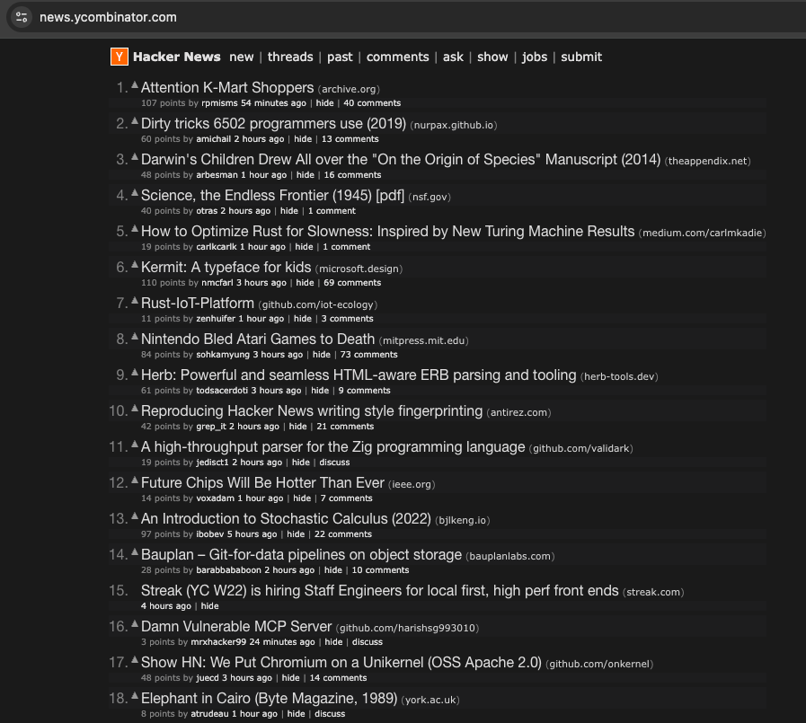

## Hacker News Dark Style 

A Chrome extension that provides a comfortable dark theme for Hacker News (news.ycombinator.com).

### Features
- Dark theme optimized for reading
- Maintains the simple aesthetic of Hacker News
- Easy on the eyes for night-time browsing

### Installation
1. Download or clone this repository
2. Open Chrome and go to `chrome://extensions/`
3. Enable "Developer mode" in the top right
4. Click "Load unpacked" and select the extension directory

### Screenshots

### Contributing
Feel free to open issues or submit pull requests to improve the theme.